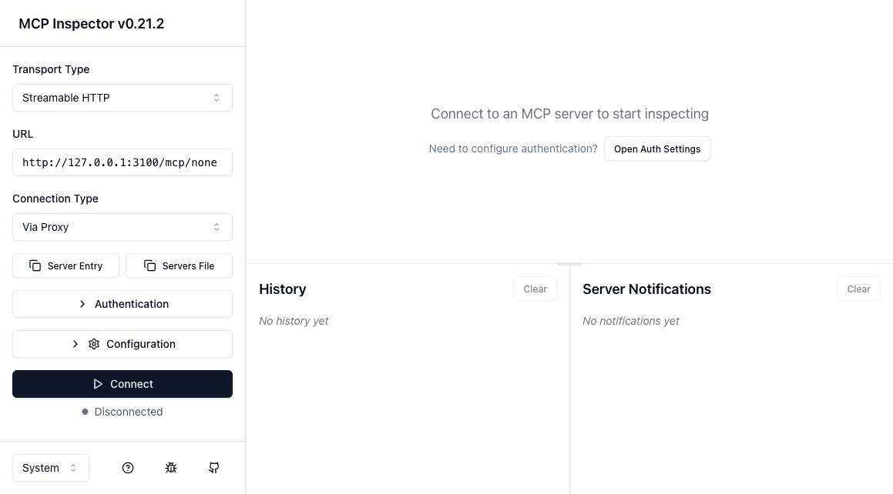
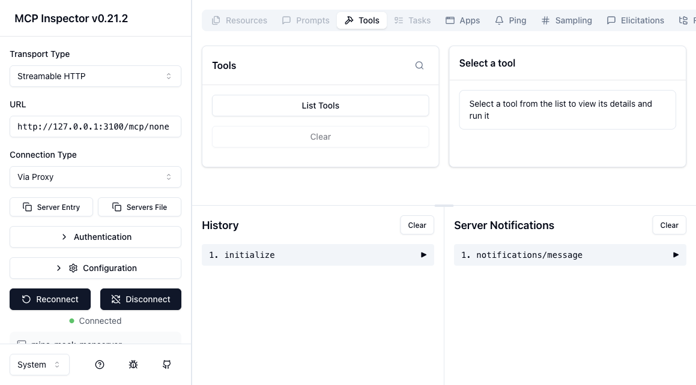
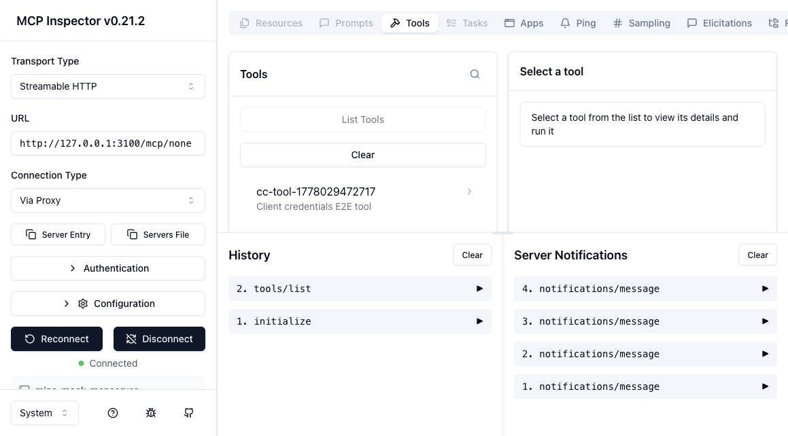
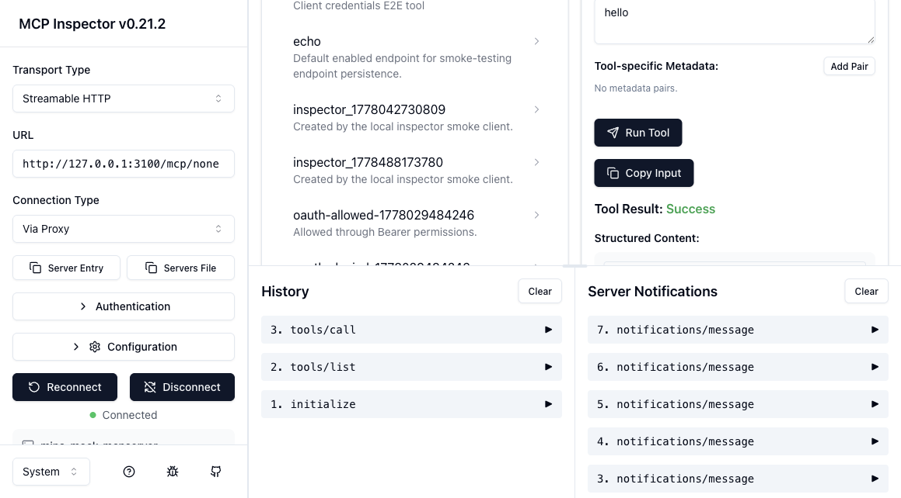
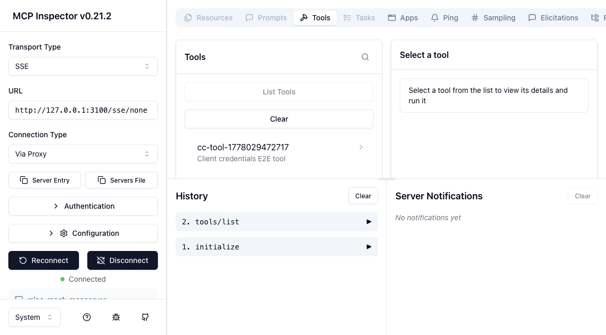
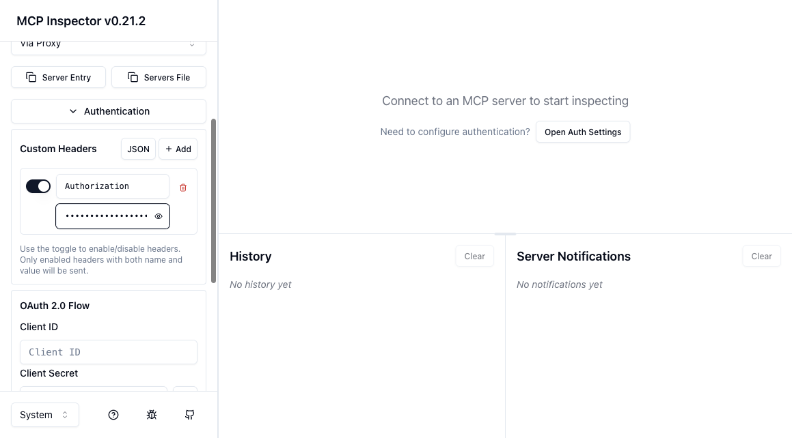
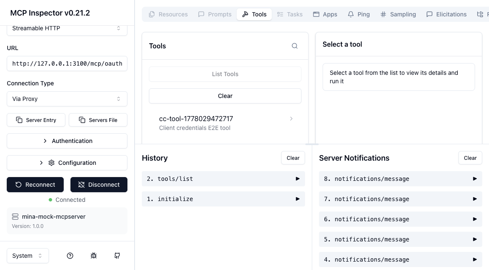

# MCP Browser Inspector Guide

This guide shows how to verify MCP Mock Server from the upstream MCP Inspector browser UI.
It uses the Inspector page at `http://localhost:6274` and the Mock Server at `http://127.0.0.1:3100`.

For the project overview and complete feature map, start with:

- [README](README.md)
- [Feature overview](docs/FEATURES.md)
- [MCP transports, SSE, REST, and OAuth calls](docs/TRANSPORTS.md)
- [Inspector integration](docs/INSPECTOR.md)

This guide is focused only on the upstream Inspector browser UI. For the project-owned standalone Inspector UI, use [Mina Inspector E2E Guide](MinaInspector.md) or run `npm run inspector:ui`.

## Prerequisites

Start MCP Mock Server:

```bash
npm run db:prepare
npm run dev
```

Start the upstream MCP Inspector:

```bash
npx @modelcontextprotocol/inspector
```

The Inspector normally opens:

```text
http://localhost:6274
```

If your Inspector prints a proxy auth token, include it in the browser URL as `MCP_PROXY_AUTH_TOKEN`.

## 1. Connect To No-Auth Streamable HTTP

Open this URL:

```text
http://localhost:6274/?MCP_PROXY_AUTH_TOKEN=PASTE_PROXY_TOKEN&transport=streamable-http&serverUrl=http%3A%2F%2F127.0.0.1%3A3100%2Fmcp%2Fnone
```

Confirm:

- Transport Type is `Streamable HTTP`
- URL is `http://127.0.0.1:3100/mcp/none`
- Connection Type is `Via Proxy`



Click **Connect**. The Inspector should show `Connected`, server name `mina-mock-mcpserver`, and version `1.0.0`.



## 2. List Tools

Open the **Tools** tab and click **List Tools**.

You should see the seeded `echo` tool and any other enabled mock tools in your local database.



## 3. Run The Seeded Echo Tool

Select `echo`.

Fill:

```text
message = hello
```

Click **Run Tool**.

Expected result:

```json
{
  "ok": true,
  "message": "world"
}
```



## 4. Verify Legacy SSE Transport

MCP Mock Server supports legacy-style SSE compatibility routes in addition to Streamable HTTP:

- `/sse`
- `/sse/none`
- `/sse/basic`
- `/sse/oauth`

Open this URL:

```text
http://localhost:6274/?MCP_PROXY_AUTH_TOKEN=PASTE_PROXY_TOKEN&transport=sse&serverUrl=http%3A%2F%2F127.0.0.1%3A3100%2Fsse%2Fnone
```

Click **Connect**, then click **List Tools**.

Expected result:

- Inspector shows `Connected`
- `initialize` appears in History
- `tools/list` appears in History
- the tool list includes `echo`



## 5. Verify Basic Auth

Open this URL:

```text
http://localhost:6274/?MCP_PROXY_AUTH_TOKEN=PASTE_PROXY_TOKEN&transport=streamable-http&serverUrl=http%3A%2F%2F127.0.0.1%3A3100%2Fmcp%2Fbasic
```

Open **Authentication**.

Enable a custom header:

```text
Header Name: Authorization
Header Value: Basic ZGVmYXVsdDpkZWZhdWx0
```

That value is the seeded `default:default` Basic credential.



Click **Connect**, then click **List Tools**.

Expected result:

- Inspector shows `Connected`
- `tools/list` succeeds
- the tool list includes `echo`


For Basic SSE, use the same header with:

```text
http://localhost:6274/?MCP_PROXY_AUTH_TOKEN=PASTE_PROXY_TOKEN&transport=sse&serverUrl=http%3A%2F%2F127.0.0.1%3A3100%2Fsse%2Fbasic
```

## 6. Verify OAuth Bearer

Issue a local OAuth token with the seeded `default/default` client:

```bash
TOKEN="$(
  curl -sS -X POST http://127.0.0.1:3100/oauth/token \
    -H 'content-type: application/x-www-form-urlencoded' \
    -d 'grant_type=client_credentials' \
    -d 'client_id=default' \
    -d 'client_secret=default' \
    -d 'resource=http://127.0.0.1:3100' \
  | node -e "let d='';process.stdin.on('data',c=>d+=c);process.stdin.on('end',()=>console.log(JSON.parse(d).access_token))"
)"
```

Open this URL:

```text
http://localhost:6274/?MCP_PROXY_AUTH_TOKEN=PASTE_PROXY_TOKEN&transport=streamable-http&serverUrl=http%3A%2F%2F127.0.0.1%3A3100%2Fmcp%2Foauth
```

Open **Authentication**.

Enable a custom header:

```text
Header Name: Authorization
Header Value: Bearer PASTE_TOKEN_HERE
```

Click **Connect**, then click **List Tools**.

Expected result:

- Inspector shows `Connected`
- `tools/list` succeeds
- only tools allowed by the token permissions are listed

The screenshot below intentionally keeps the Authentication panel closed so the Bearer token is not visible.



For OAuth SSE, use the same Bearer header with:

```text
http://localhost:6274/?MCP_PROXY_AUTH_TOKEN=PASTE_PROXY_TOKEN&transport=sse&serverUrl=http%3A%2F%2F127.0.0.1%3A3100%2Fsse%2Foauth
```

## 7. Related Project Inspector Paths

If you want to test flows that upstream Inspector does not make easy, use the project-owned standalone Inspector:

```bash
npm run inspector:ui
```

Open:

```text
http://127.0.0.1:3200
```

Use:

- `/mock` for broad Mock Server E2E coverage
- `/generic` for one MCP endpoint with no-auth/Basic/Bearer helpers
- `/oauth` for browser login, consent, PKCE code exchange, and final Bearer MCP verification

## Troubleshooting

### Connection Error: proxy session token

If the UI says:

```text
Connection Error - Did you add the proxy session token in Configuration?
```

restart Inspector and copy the current proxy token into the URL:

```text
?MCP_PROXY_AUTH_TOKEN=PASTE_PROXY_TOKEN
```

### Inspector Tries `/register`

If a no-auth target tries OAuth dynamic registration and fails with `Cannot POST /register`, open **Authentication** and disable custom auth headers or OAuth settings from previous sessions.

### Basic Auth Fails

Check that the custom header switch is enabled and the value is exactly:

```text
Basic ZGVmYXVsdDpkZWZhdWx0
```

### OAuth Bearer Fails

Issue a fresh token and make sure the `resource` value matches the server origin:

```text
http://127.0.0.1:3100
```

Expired or revoked tokens correctly fail with a Bearer authentication error.
