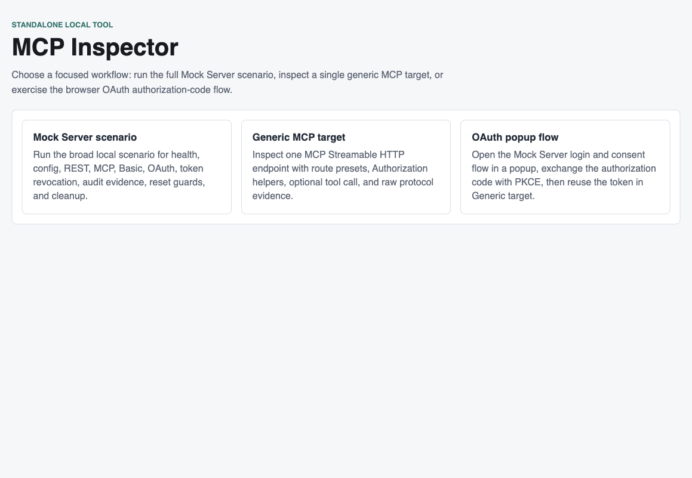
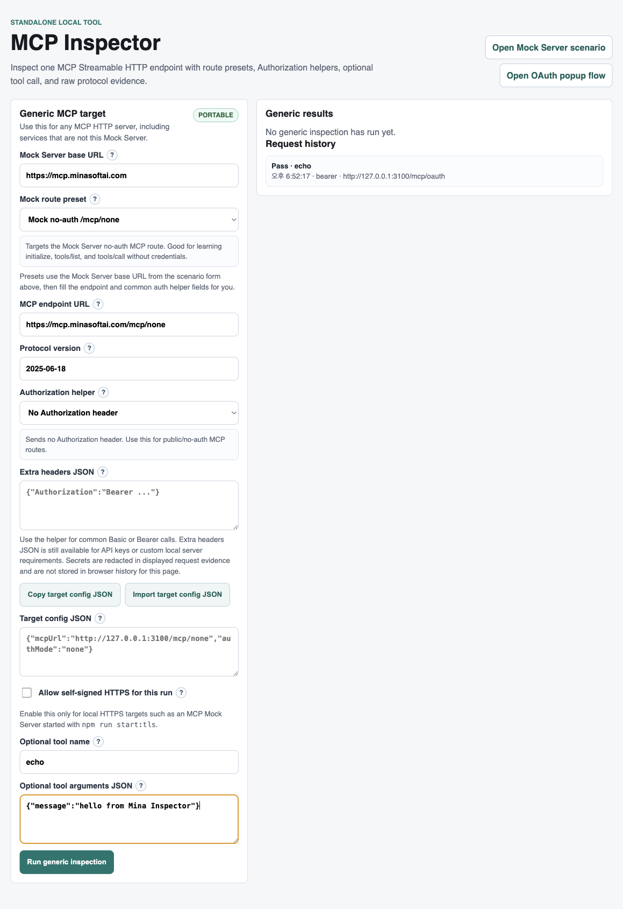
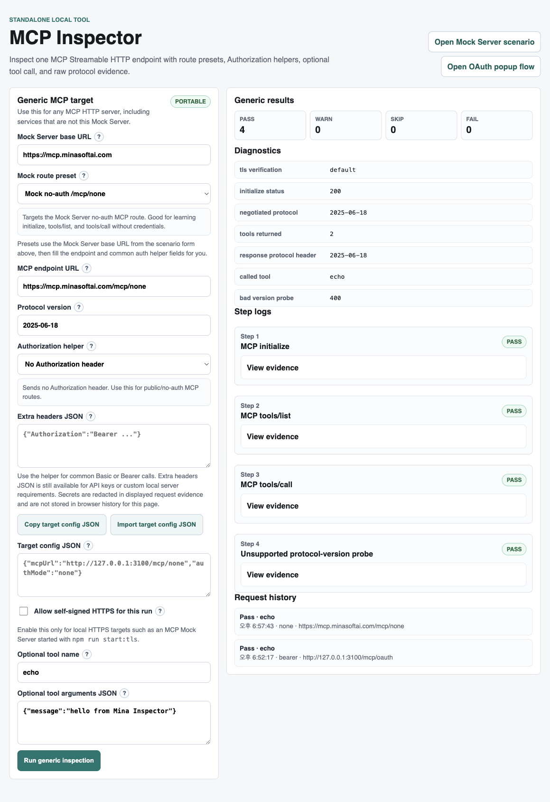
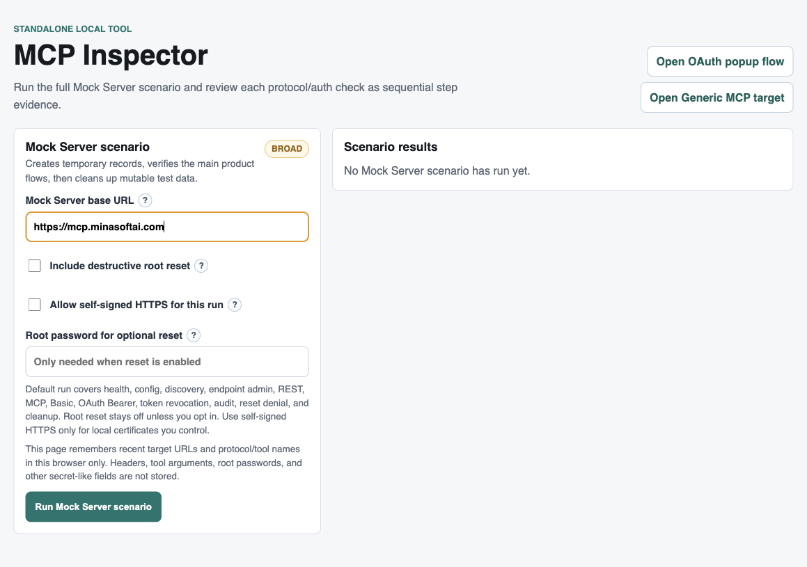
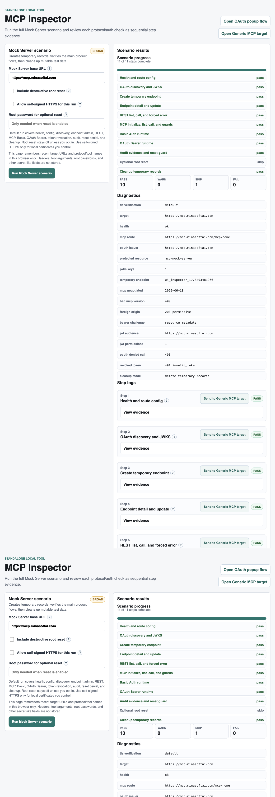
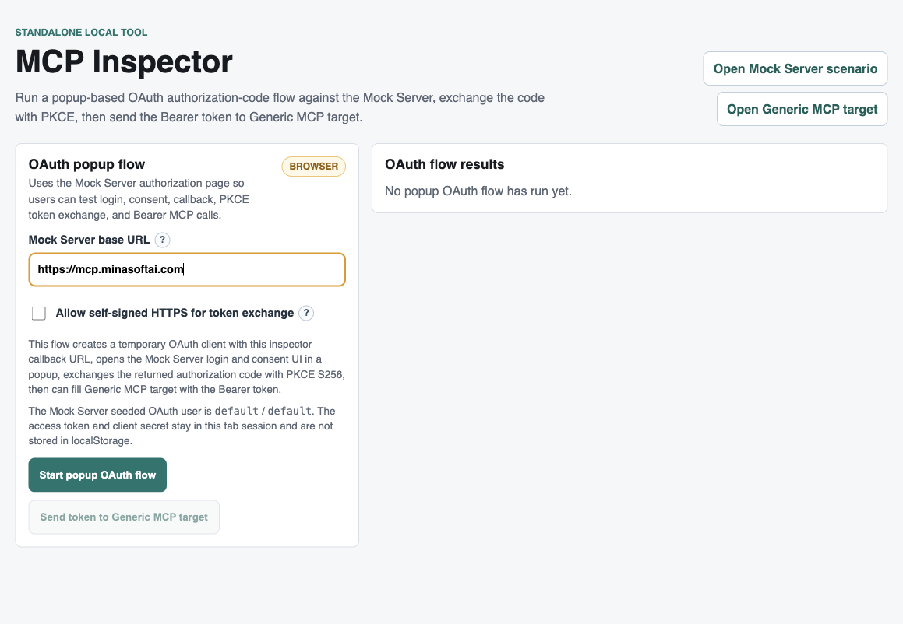
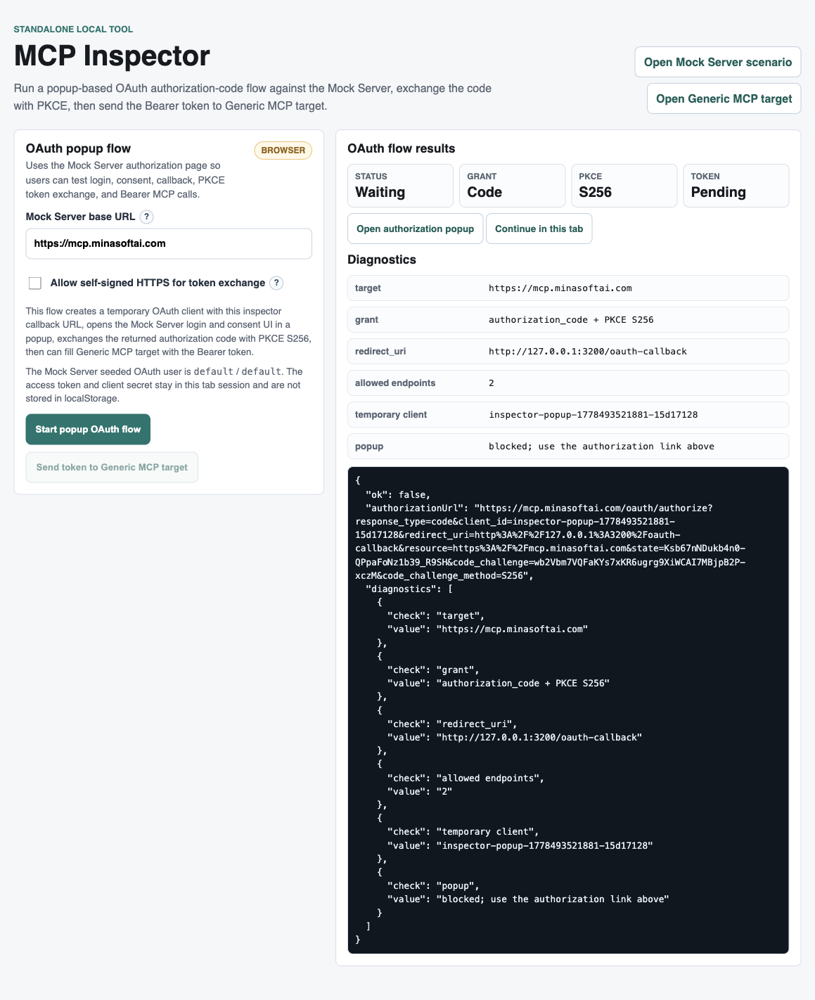
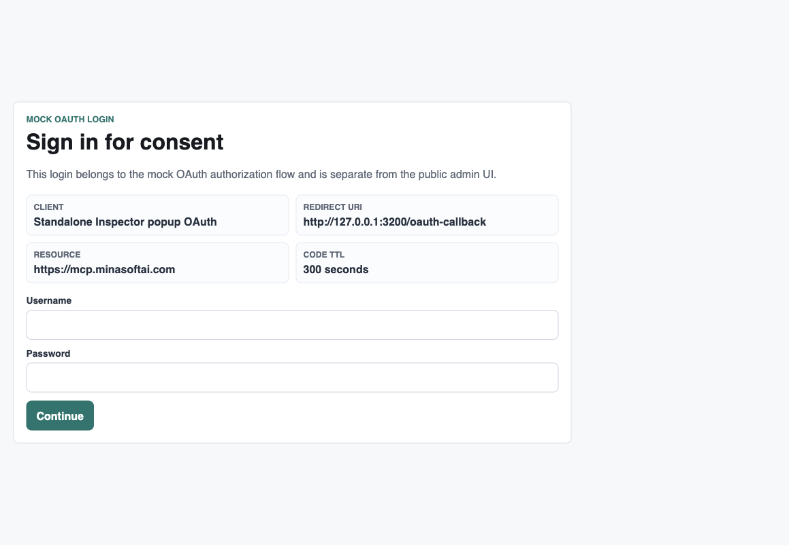
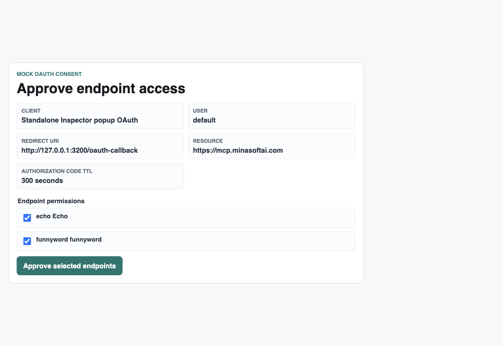
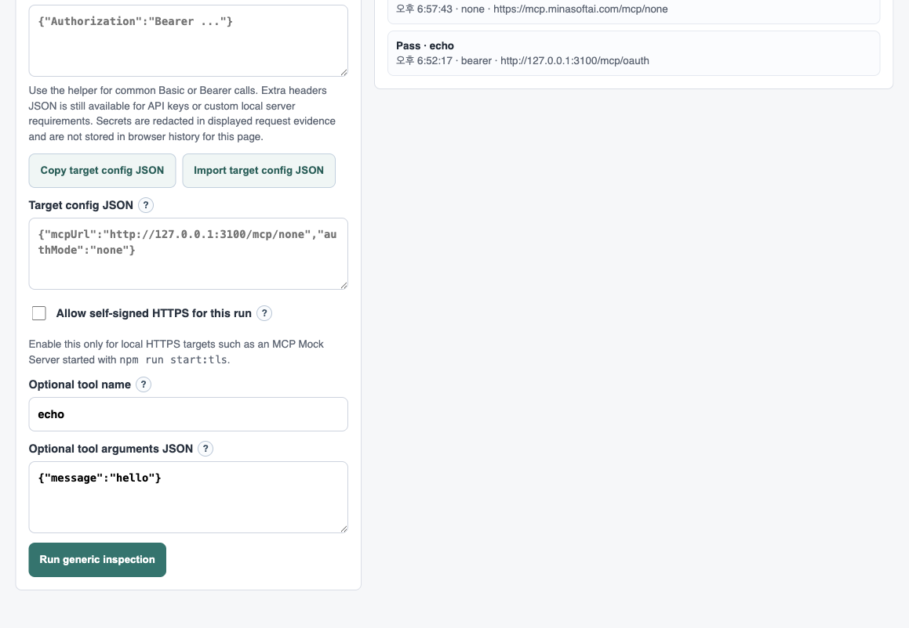

# Mina Inspector E2E Guide

This guide documents an end-to-end verification run using the project-owned standalone Inspector UI.

For the project overview and complete feature map, start with:

- [README](README.md)
- [Feature overview](docs/FEATURES.md)
- [Getting started](docs/GETTING_STARTED.md)
- [MCP transports, SSE, REST, and OAuth calls](docs/TRANSPORTS.md)
- [Inspector integration](docs/INSPECTOR.md)

This guide focuses on the hosted MCP Mock Server at:

```text
https://mcp.minasoftai.com
```

Inspector used: local standalone project inspector at `http://127.0.0.1:3200`

The guide applies to the current documented release line, including `v1.0.9`. Screenshots may show earlier local data, but the flow names and expected outcomes remain the same.

## Result Summary

| Flow | Target | Result |
| --- | --- | --- |
| Generic MCP no-auth inspection | `https://mcp.minasoftai.com/mcp/none` | Pass 4, Fail 0 for tools; resources/prompts/completion presets pass individually |
| Generic legacy SSE inspection | `https://mcp.minasoftai.com/sse/none` | Pass when upstream Inspector uses `transport=sse` |
| Full Mock Server scenario | `https://mcp.minasoftai.com` | Pass 11, Skip 1, Fail 0 |
| OAuth authorization-code + PKCE + Bearer MCP | `https://mcp.minasoftai.com/mcp/oauth` | Pass 4, Fail 0 |

## 1. Open The Local Inspector

Start the standalone project inspector:

```bash
npm run inspector:ui
```

Open:

```text
http://127.0.0.1:3200
```

The first screen offers three focused workflows: Mock Server scenario, Generic MCP target, and OAuth popup flow.



## 2. Verify Generic MCP No-Auth

Open **Generic MCP target**.

Set:

```text
Mock Server base URL: https://mcp.minasoftai.com
Mock route preset: Mock no-auth /mcp/none
Optional tool name: echo
Optional tool arguments JSON: {"message":"hello from Mina Inspector"}
```



Click **Run generic inspection**.

Expected result:

- `MCP initialize`: pass
- `MCP tools/list`: pass
- `MCP tools/call`: pass
- `Unsupported protocol-version probe`: pass
- Summary: `Pass 4`, `Fail 0`



Run additional **MCP method preset** checks from the same Generic page:

- `resources/list`
- `resources/read` with `{"uri":"mock://resources/server-status"}`
- `resources/templates/list`
- `prompts/list`
- `prompts/get` with `{"name":"support_reply","arguments":{"tone":"friendly"}}`
- `completion/complete prompt`
- `completion/complete resource template`

## 3. Run Full Mock Server Scenario

Open **Mock Server scenario**.

Set:

```text
Mock Server base URL: https://mcp.minasoftai.com
Include destructive root reset: unchecked
Allow self-signed HTTPS: unchecked
```



Click **Run Mock Server scenario**.

Expected result:

- Health and route config: pass
- OAuth discovery and JWKS: pass
- Temporary endpoint creation/update: pass
- REST list/call/forced error: pass
- MCP initialize/list/call/protocol guard/browser Origin compatibility: pass
- Resources, Resource Templates, Prompts, Completion, and SSE notifications: pass
- Basic Auth runtime: pass
- OAuth Bearer tool/resource/prompt permission runtime: pass
- Audit evidence and reset guard: pass
- Optional root reset: skip
- Cleanup temporary records: pass
- Summary: `Pass 11`, `Skip 1`, `Fail 0`



## 3.5. Verify Legacy SSE With Upstream Inspector

The project-owned Inspector focuses on Streamable HTTP MCP calls. To verify legacy SSE compatibility for the hosted server, use upstream Inspector:

```bash
npx @modelcontextprotocol/inspector
```

Open:

```text
http://localhost:6274/?transport=sse&serverUrl=https%3A%2F%2Fmcp.minasoftai.com%2Fsse%2Fnone
```

Expected result:

- Inspector connects with `transport=sse`
- the SSE stream emits an endpoint message route
- `initialize` and `tools/list` succeed
- `resources/list` and `resources/read` can also be checked from the CLI with the same SSE target
- the seeded `echo` tool appears

For Basic or OAuth SSE, use `/sse/basic` or `/sse/oauth` and add the same `Authorization` header used for Streamable HTTP checks.

## 4. Verify OAuth Authorization-Code Flow

Open **OAuth popup flow**.

Set:

```text
Mock Server base URL: https://mcp.minasoftai.com
Allow self-signed HTTPS: unchecked
```



Click **Start popup OAuth flow**.

In the Codex in-app browser, popup windows are blocked, so the inspector shows fallback links. Use **Continue in this tab**. In a normal local browser, **Open authorization popup** may open a popup directly.



On the Mock OAuth login page, sign in with the seeded test user:

```text
Username: default
Password: default
```



On the consent page, keep the desired endpoint permissions selected and click **Approve selected endpoints**.



After approval, the local inspector callback exchanges the authorization code using PKCE S256 and redirects to **Generic MCP target** with a Bearer token filled for:

```text
https://mcp.minasoftai.com/mcp/oauth
```

Click **Run generic inspection**.

Expected result:

- `MCP initialize`: pass
- `MCP tools/list`: pass
- `MCP tools/call`: pass
- `Unsupported protocol-version probe`: pass
- Summary: `Pass 4`, `Fail 0`



## Notes

- The inspector intentionally does not store OAuth client secrets, authorization codes, code verifiers, or Bearer tokens in persistent browser storage.
- The broad Mock Server scenario creates temporary endpoint, Basic user, OAuth user, OAuth client, and token records, then cleans up mutable temporary records at the end.
- The Codex in-app browser blocks popup windows, so the same-tab fallback is required there. This fallback still validates the same authorization-code, consent, PKCE exchange, and Bearer MCP flow.
- Use [MCP Browser Inspector Guide](MCPBrowserInspector.md) for upstream Inspector screenshots and [docs/TRANSPORTS.md](docs/TRANSPORTS.md) for copy-ready Streamable HTTP, SSE, REST, and OAuth commands.
